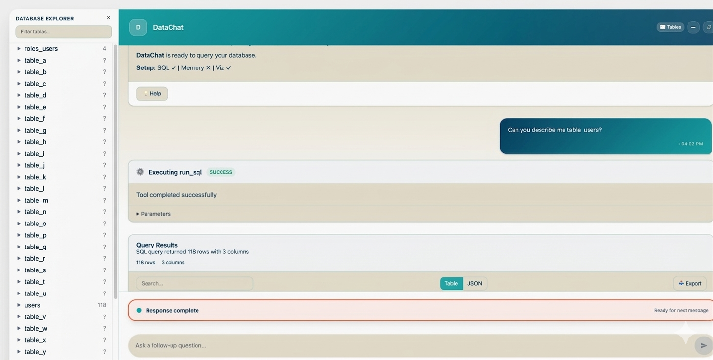

# I Turned an Archived 23K-Star Text-to-SQL Project Into a Self-Hosted Tool That Actually Works Out of the Box

Vanna.ai is a text-to-SQL framework that lets you ask questions in plain English and get SQL queries, results, and charts back. It gained 23,000+ stars on GitHub — a clear sign the community wanted this.

Then, in March 2026, the open-source repository was archived. A paid hosted version is available as Vanna Cloud, but if you prefer to self-host and own the setup, the archived codebase needs some work.

I decided to fork it and fix what was missing. The result is **DataChat** — a self-hosted text-to-SQL chat interface built on Vanna 2.0.2 that's actually ready to use.



## What is Text-to-SQL?

If you work with databases, you know the friction: someone on the team needs data, but they don't write SQL. So they ask an engineer, who writes a query, runs it, and sends back a spreadsheet. This happens dozens of times a day in most companies.

Text-to-SQL changes this. You type a question like "How many new users signed up last month?" and the system generates the SQL, executes it against your database, and returns the results — sometimes with a chart.

Under the hood, an LLM generates the SQL using your database schema as context. The quality of the output depends heavily on how well the system knows your schema — table names, column types, relationships. This is where RAG (Retrieval-Augmented Generation) comes in: the system stores your schema in a vector database and retrieves the relevant pieces when generating each query.

## What I Found When I Tried to Self-Host Vanna

I cloned the archived repo, installed the dependencies, and quickly ran into a series of paper cuts that added up to a frustrating experience.

### No Way to See Your Schema

The original has no database explorer. You open the chat interface and you're looking at an input box — that's it. You're chatting blind, hoping the AI guesses your table and column names correctly.

If you have a database with hundreds of tables, this is a problem. You need to know what's available before you can ask meaningful questions.

**DataChat fix:** A full schema sidebar shows all your tables and columns the moment the page loads. Click a table to expand its columns and see data types. Double-click a table name to insert it directly into the chat input. The layout is full-viewport instead of the original's small centered card.

### Stale Schema Context and No Database Switching

The original has a training script to load your schema into ChromaDB, but you have to remember to run it manually whenever your schema changes. If you add tables or columns and forget to retrain, the LLM will generate SQL against an outdated understanding of your database.

Worse, the database name is hardcoded in `.env`. Want to explore a different database on the same server? Stop the server, edit the config file, restart. Every time.

**DataChat fix:** `start.py` automatically refreshes your schema on every launch — no stale context, no manual step to forget. And switching databases is a single flag:

```bash
# See what's available on your PostgreSQL server
python start.py --list-databases

# Start with a different database
python start.py --database analytics
```

No config editing, no restarts. The flag overrides the database for both schema training and the running server.

### Manual Frontend Build

The original requires you to navigate into the frontend directory, run `npm install`, then `npm run build`, then navigate back to the project root before you can start the server. It's a multi-step process that's easy to forget and confusing if you're not a frontend developer.

**DataChat fix:** `python start.py` detects a missing frontend build and runs it automatically. One command, zero frontend knowledge needed. If the build already exists, it skips it — delete the `dist/` directory to force a rebuild.

### Serialization Crashes on Real Data

Wide tables with complex column types — arrays, JSON fields, timestamps with time zones — break the original's result serialization. This was a known issue (reported as #1054 on the original repo) but was never fixed before the project was archived.

**DataChat fix:** Patched. Also added a table/JSON toggle for query results. Wide tables with many columns are hard to read in a horizontal data frame — the JSON view lets you scroll vertically instead, which is much more practical when you're dealing with tables that have 20+ columns.

## Cloud or Local — Your Choice

DataChat works with both cloud and local LLMs. I've tested it with:

| Provider | Model | Notes |
|----------|-------|-------|
| Gemini | `gemini-2.5-flash` | Fast, strong tool calling. Requires a Google API key. |
| Ollama | `mistral-small3.1:latest` | Good tool calling support. Runs fully local, ~16GB RAM. |

Switching between them is a single environment variable:

```
LLM_PROVIDER=gemini    # use Google's Gemini API
LLM_PROVIDER=ollama    # use a local model via Ollama
```

If you use Ollama, your data never leaves your machine. The queries, results, and schema all stay local. Ollama also loads models on demand — you don't need to manually start anything before running DataChat.

## Getting Started

```bash
# Create virtualenv
uv venv .venv --python 3.12
source .venv/bin/activate

# Install
uv pip install -e ".[gemini,ollama,postgres,chromadb,fastapi]" python-dotenv

# Configure
cp .env.example .env
# Edit .env with your API keys and database credentials

# Start (trains on schema then launches server)
python start.py

# Or start without retraining (uses existing training data)
python main.py
```

Open http://localhost:8084 and you'll see your database schema on the left and a chat input ready to go.

## What's Next

DataChat is MIT licensed and open for contributions. It currently supports PostgreSQL and BigQuery as data sources. The codebase inherits Vanna 2.0's pluggable architecture, so adding new database backends or LLM providers is straightforward.

If you've been looking for a self-hosted text-to-SQL tool that works without a lengthy setup process — give it a try.

**GitHub:** https://github.com/drharunyuksel/datachat
